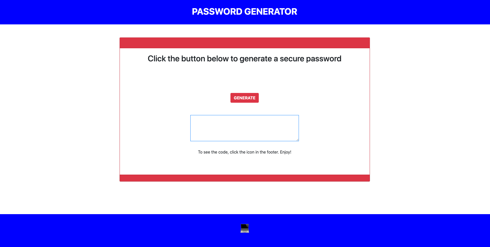

# passwordGenerator

## Description

Password Generator takes 5 criteria from the user: 

    1. A choice of password length ranging from 8 to 128 characters in length.
    2. A choice of lowercase letters to be included.
    3. A choice of uppercase letters to be included.
    4. A choice of numbers to be included.
    5. A choice of special characters to be included.

    Once the criteria has been selected and the user clicks the "GENERATE" button, a password matching the user criteria will be displayed in the text area.  Click the icon at the bottom of the page to see the code.

## User Story

AS AN employee with access to sensitive data
I WANT to randomly generate a password that meets certain criteria
SO THAT I can create a strong password that provides greater security

##  Languages / Technologies / Frameworks Used

*   Javascript / CSS / Bootstrap / HTML

##  Links

* GitHub: https://github.com/coreyspratlan/passwordGenerator

* GitHub Pages: https://coreyspratlan.github.io/passwordGenerator/

##  ScreenShot of Application

